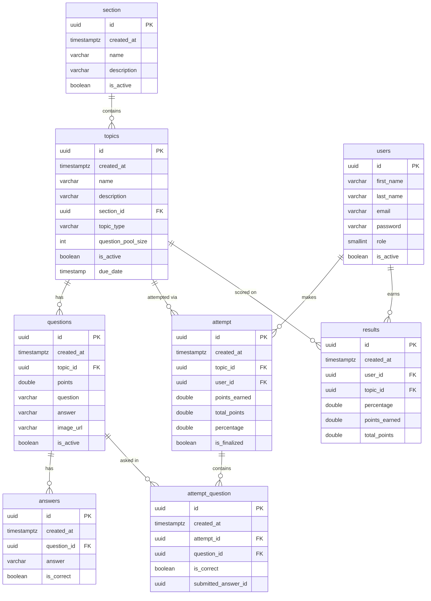

# Database Schema

PostgreSQL, with the schema generated by Hibernate from the JPA entities in `entities/`.

## Conventions

- All IDs are UUIDs generated by the application.
- `created_at` is set automatically on insert and never updated.
- `is_active` hides a record without deleting it.
- `percentage` is stored as a fraction from 0 to 1, not 0 to 100.
- `topic_type` is stored as text (`TEST`, `QUIZ`, `REVIEW`, `RANDOM_QUESTIONS`).
- `role` is stored as a number (`0` = STUDENT, `1` = ADMIN).
- `submitted_answer_id` is a plain UUID, not a foreign key.

## Deletion behavior

Deleting a section removes its topics, which removes their questions, which removes their answers (JPA cascade).